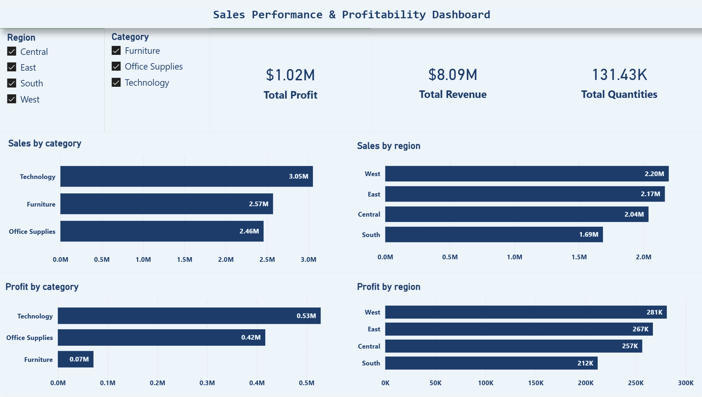

📊 Sales Data Pipeline & Analytics Dashboard

🔍 Overview

This project demonstrates an end-to-end data pipeline built to analyze e-commerce sales performance and profitability.

The pipeline processes raw transactional data, transforms it into a structured relational model, and generates business insights through SQL and Power BI.

---

🎯 Problem Statement

How can we analyze sales data to identify key business metrics such as revenue trends, top-performing categories, regional performance, and profitability?

---

⚙️ Tech Stack

- Python (pandas)
- MySQL
- Power BI

---

🔄 Data Pipeline Flow

Raw CSV → Data Cleaning (Python) → Data Modeling → MySQL (Relational Tables) → SQL Views → Power BI Dashboard

---

🧹 Data Processing (Python)

- Cleaned and standardized column names
- Removed duplicates and handled missing values
- Filtered invalid records (e.g., zero/negative sales)
- Transformed raw data into structured tables:
  - customers
  - products
  - orders
  - sales

---

🗄️ Database Design (MySQL)

- Designed normalized schema using:
  - Dimension tables: customers, products, orders
  - Fact table: sales
- Established relationships using primary and foreign keys

---

📈 SQL Analysis

Performed analysis using joins and aggregations:

- Total Revenue
- Sales by Category
- Sales by Region
- Monthly Revenue Trends
- Profit Analysis

Created a view:

- "sales_summary" for aggregated reporting

---

📊 Dashboard (Power BI)

The dashboard includes:

- KPI cards (Revenue, Profit, Quantity)
- Monthly sales trend
- Category-wise performance
- Region-wise analysis
- Profitability insights

📊 Dashboard Preview

---

💡 Key Insights

- Identified top-performing categories contributing to revenue
- Analyzed regional sales distribution
- Evaluated profitability across product segments
- Observed monthly sales trends for business decision-making

---

🚀 Project Structure

sales_pipeline/
 ├── data/
 │    ├── raw/    
 ├── scripts/
 │    ├── process_data.py
 │    └── load_to_sql.py
 ├── sql/
 ├── dashboard/

---

🧠 What I Learned

- Building structured data pipelines from raw data
- Designing relational database schemas
- Writing analytical SQL queries and views
- Connecting backend data systems to BI tools

---

📌 Conclusion

This project demonstrates the ability to build a complete data workflow from raw data ingestion to business-level insights, combining data engineering fundamentals with analytics.

---
